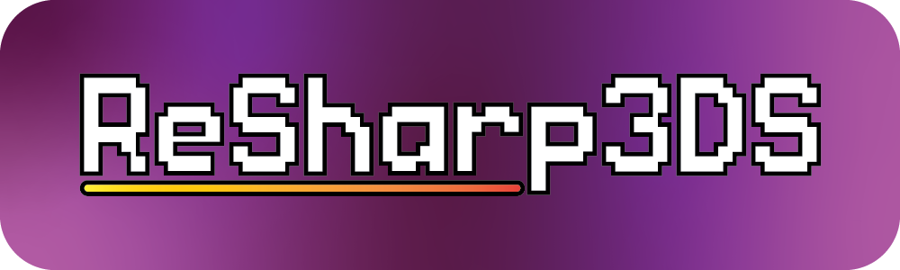
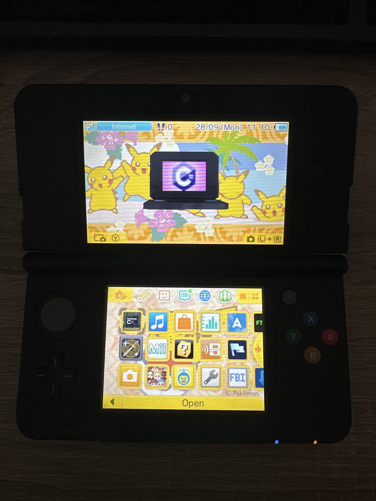
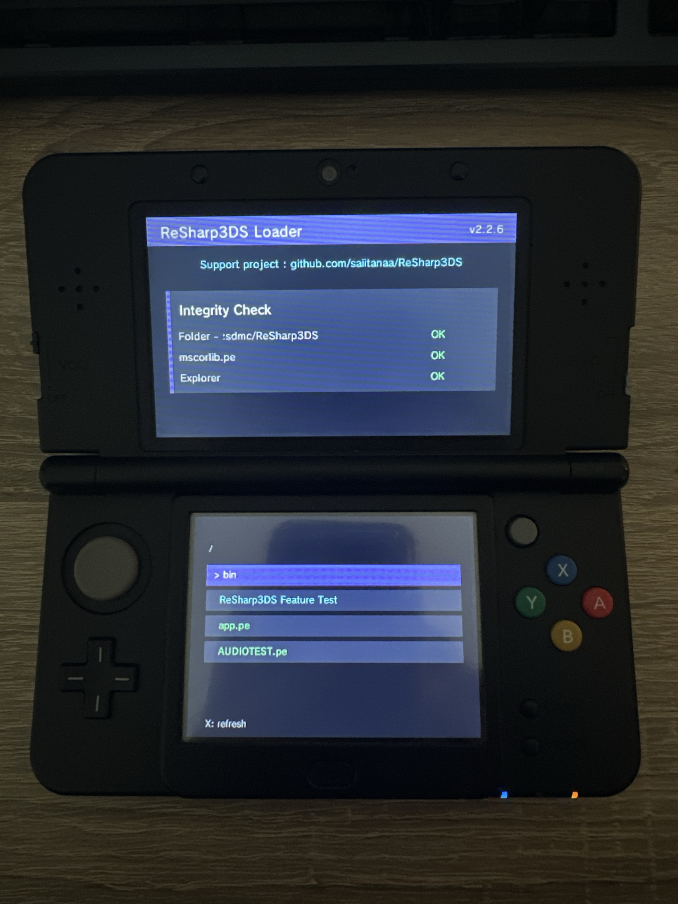

## Portage of nanoCLR on Nintendo 3DS.

**C# development for the 3DS it is finally possible !**

> Download ReSharp3DS : <a href="https://github.com/saiitanaa/ReSharp3DS/releases/latest">Latest Release</a> 

### Preview


<video src="./assets/demo.mov" controls preload></video>
## Index 

> Getting Started : <a href="https://github.com/saiitanaa/ReSharp3DS/blob/main/GettingStarted.md">Documentation</a>

> ReSharp3DS API : <a href="https://github.com/saiitanaa/ReSharp3DS/blob/main/API.md">Look API</a>

> Download Apps Templates : <a href="https://github.com/saitanaa/ReSharp3DS-Templates">Check repo</a>

> Build your own Homebrew ? : Check <a href="https://github.com/saiitanaa/ReSharp3DS/blob/main/Builder.md">ReSharp3DS Builder</a>

> ReSharp3DS is available on Universal Updater ! <a href="https://db.universal-team.net/3ds/resharp3ds">Universal-Updater</a>

## Screenshots on Real hardware

 


--- 

## File Structure

```txt
SD:/
├── 3ds/
│   └── ReSharp3DS.3dsx
└── ReSharp3DS/
    ├── bin/
    │   └── mscorlib.pe
    ├── app.pe
    ├── apps/
    │   └── TestApp/
    │       ├── manifest.json
    │       ├── app.pe
    │       └── assets/
    │           ├── sprite.bmp
    │           └── sound.wav
    └── logs/
        ├── crash.txt
        ├── clr-panic.txt
        └── <AppName>.log
```

The runtime dependency is expected at:

```txt
sdmc:/ReSharp3DS/bin/mscorlib.pe
```

The launcher scans:

```txt
sdmc:/ReSharp3DS/
```

and displays folders and `.pe` applications. `mscorlib.pe` is ignored by the launcher.

If a `.pe` file is declared in `manifest.json`, the launcher can display the manifest `name`, `author`, and `version` instead of the raw `.pe` filename.

---

## Troubleshooting

If a file is missing or incorrectly placed, the program will display an error:
`[FATAL] app load failed`

Make sure the `ReSharp3DS` folder is at the **root** of the SD card, not inside the `/3ds/` folder.

### `[FATAL] mscorlib load failed`

Check that:

```txt
sdmc:/ReSharp3DS/bin/mscorlib.pe
```

exists and matches the nanoFramework version used by the SDK.

### The launcher shows no apps

Check that your `.pe` files are inside:

```txt
sdmc:/ReSharp3DS/
```

or inside a subfolder.

### BMP does not draw

Check that the file is:

```txt
BMP
24-bit or 32-bit
uncompressed
```

Also check that the path is relative to the running `.pe` file.

### Audio does not work on real hardware

Make sure DSP has been dumped correctly and is available on the SD card.
